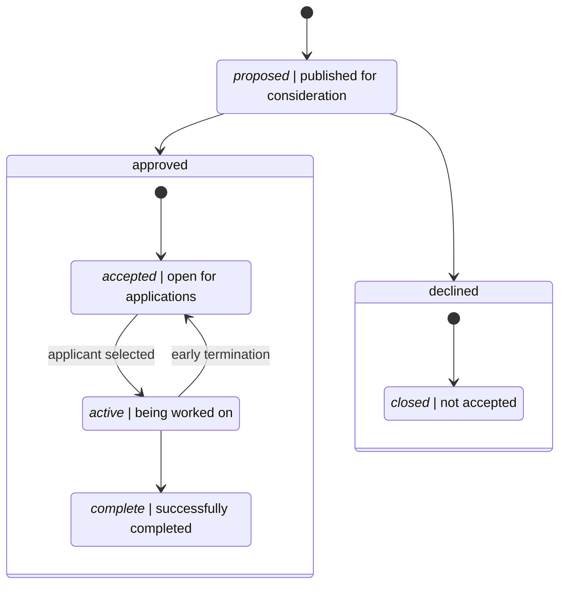

# µGrants

A _micro grant_, or µGrant, is a fixed-scope, fixed-compensation
foundation-sponsored project. Compensation is _staged_ upon completion of
predefined milestones. Any entity, including an individual, is eligible to
apply. A µGrant is awarded to the first applying entity that meets all of the
grant's applicants' requirements which may include foundation approval and
demonstration of key knowledge prerequisites.

## Eligible Projects

A project is eligible to be structured as a µGrant if it meets the following
criteria:

  * **The project directly or indirectly benefits Rocket or other RWF2 efforts.**

    This includes work to improve Rocket and its libraries: `rocket`,
    `rocket_db_pools`, and `rocket_ws`, among others, Rocket's documentation
    including the _rustdocs_ and the _guide_, Rocket's fixed dependencies such
    as `cookie`, `tokio`, `futures`, and `serde`, tooling such as `rustc` and
    `cargo`, and any web or related properties.

  * **The project has concrete milestones and deliverables.**

    Progress must be measurable via milestones with concrete deliverables such
    that it is possible to unambiguously determine whether a deliverable
    realizes a milestone. As a result, open-ended research projects are unlikely
    to be candidates for a µGrant while code implementation projects make
    excellent candidates.

  * **The project is realizable within a definite time frame by qualified
    candidates.**

    Given an entity meeting a set of skill or experience-based requirements, a
    project should be realizable within a definite time frame. The project must
    be self-contained, and the ability to make progress must be dependent only
    on the grantee and the foundation. For example, a project to "improve
    performance" without further qualification is a poor µGrant candidate as
    such a project has a potentially infinite time horizon. Similarly, a project
    that requires participation from entities outside of the foundation to make
    progress is a poor candidate as realizing the project can be arbitrarily
    stalled by those external entities.

The **foundation** is tasked with judging µGrant eligibility based on the above
criteria.

## Process and Proposals

A µGrant is always in one of the following states: _proposed_, _accepted_,
_active_, _closed_, or _complete_.

If a µGrant is proposed, it may be _accepted_, in which case the grant becomes
open for applications. Once an applicant has been selected and assigned by the
**foundation**, the grant is _active_. Once all milestones are met and all
compensation remitted, the grant is _completed_. If a grant is not accepted, it
is _closed_.

A µGrant may be _proposed_ by any entity but can only be _accepted_ by the
**foundation**. An entity that proposes a grant is also eligible to apply for
that grant once accepted, but no preference is given to the proposing entity.

Grants by the **foundation** itself are not required to be _proposed_.

## Early Termination

If an accepted applicant indicates that they are unable to complete a milestone
or cannot be reached after several attempts, the µGrant is re-accepted and
becomes eligible for new applications. The re-accepted µGrant is composed of all
incomplete milestones, and compensation is recalculated based on remaining tasks
such that the sum of already issued compensation and remaining compensation is
equal to the original compensation amount.

## Structure

A micro-grant proposal _must_ include:

  * **Summary**

    A summary of the grant including the grant's motivation, compensation,
    goals, non-goals, milestones, compensation. This should be pithy and consist
    of at most a couple of paragraphs.

  * **Motivation**

    A description of why this grant exists. For example, for changes to source
    code, a description of the functionality availed by the changes proposed.

  * **Applicant's Requirements**

    A list of minimum requirements for an applicant to be considered. Each
    requirement must be objective such that both the **foundation** and
    prospective candidates can unambiguously decide whether a requirement is
    met.

  * **Goals & Non-Goals**

    Two lists: one with goals (what we're trying to achieve) and one with
    non-goals (what we want to avoid). Each goal and non-goal should be expanded
    on as necessary.

  * **Details**

    A complete description of the proposed project.

  * **Milestones & Deliverables**

    A list of project milestones and the associated deliverables. Each milestone
    should be accompanied by a completion criteria: what needs to hold for a
    milestone to be considered complete.

  * **Compensation Schedule**

    How the project's total compensation will be distributed based on milestone
    completion.

## Applications

Applications are submitted in the open. Each application must include:

  * **Statement of Interest**

    A brief statement explaining the applicant's interest in receiving the
    grant.

  * **Attestation of Met Requirements**

    A point-by-point attestation that the application meets or exceeds all of
    the list requirements.

  * **Fulfillment Plan**

    A summary of the applicant's proposed approach to fulfilling the grant's
    milestones.

### Compensation Election

An accepted applicant may elect to _donate_ the associated compensation to the
RWF2. In this case, a donation receipt will be provided to the grantee upon
completion of a compensated milestone.

### Payouts

Immediately upon successful completion of a compensated milestone, a payout will
be scheduled for the associated amount. Payments will be sent via PayPal or
Transferwise. Payees are responsible for properly reporting the payout as
necessary by their governing law.
